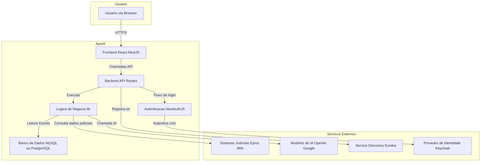
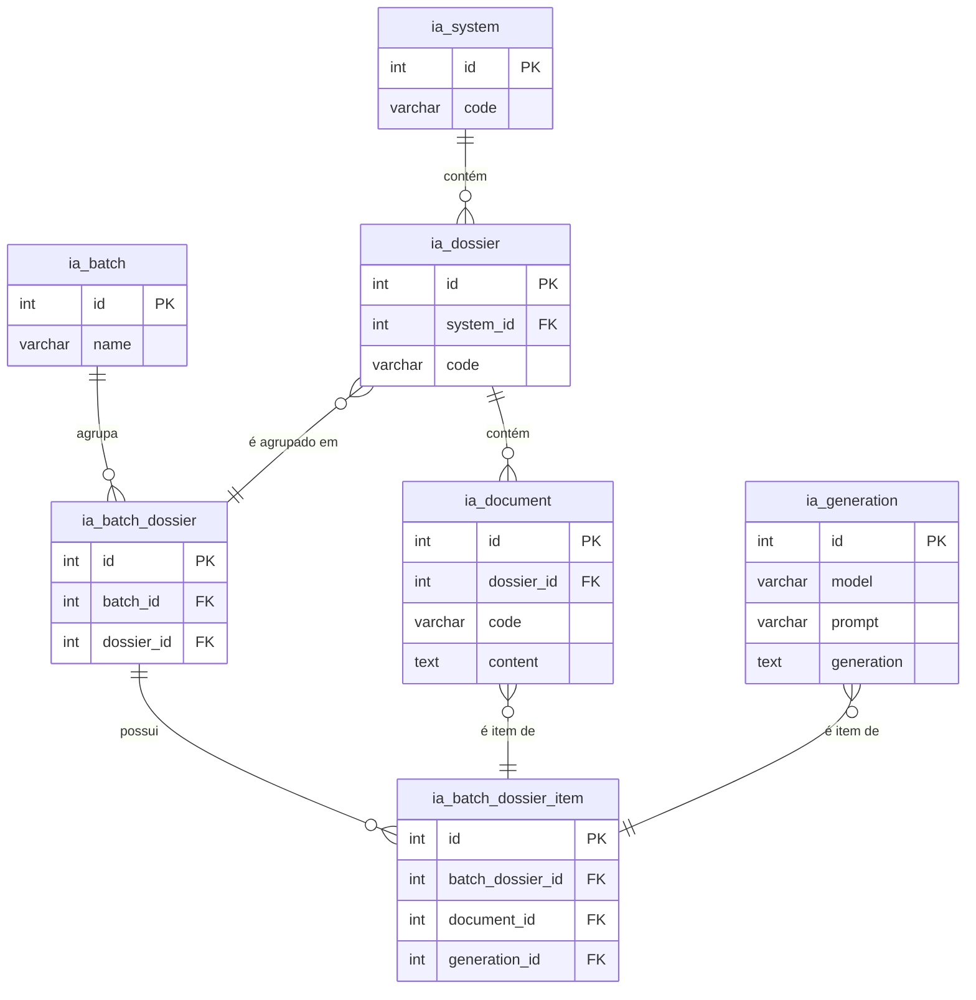

# Manual de Operação

## Glossário

*   **Dossiê:** Representação de um processo judicial no sistema ApoIA.

*   **Ementa:** Resumo estruturado de uma decisão judicial, gerado pela IA conforme padrões específicos (e.g., Resolução CNJ).

*   **Eproc:** Sistema de processo judicial eletrônico com o qual a ApoIA se integra.

*   **JWE (JSON Web Encryption):** Padrão de criptografia usado para proteger os tokens de autenticação da API, garantindo a confidencialidade das informações.

*   **JWT (JSON Web Token):** Token compacto e autossuficiente usado para transmitir informações de forma segura entre as partes como um objeto JSON.

*   **Knex.js:** Construtor de consultas SQL para Node.js, utilizado pela ApoIA para interagir com o banco de dados (MySQL/PostgreSQL).

*   **MNI (Modelo Nacional de Interoperabilidade):** Padrão definido pelo Conselho Nacional de Justiça (CNJ) para a comunicação e troca de informações entre os sistemas do Poder Judiciário brasileiro.

*   **Next.js:** Framework de desenvolvimento web React utilizado como base para a construção da aplicação ApoIA.

*   **NextAuth.js:** Biblioteca de autenticação para aplicações Next.js, responsável por gerenciar o login e as sessões dos usuários.

*   **Peça Processual:** Cada um dos documentos que compõem um processo judicial (ex: petição inicial, contestação, sentença).

*   **Prompt:** Conjunto de instruções ou um texto de entrada fornecido a um modelo de IA generativa para direcionar a geração de uma resposta específica.

*   **Triagem:** Análise inicial de um conjunto de processos para classificá-los ou resumi-los, uma das principais funcionalidades da ApoIA.

*   **Vercel AI SDK:** Kit de desenvolvimento de software utilizado para facilitar a integração com diferentes modelos e provedores de IA generativa.

*   **WSDL (Web Services Description Language):** Linguagem baseada em XML usada para descrever as funcionalidades de um serviço web, utilizada na integração com o MNI.

## Indice

*   [Glossário](#glossário)
*   [Introdução](#introdução)
*   [Objetivo](#objetivo)
*   [Visão Geral do Sistema](#visão-geral-do-sistema)
*   [Público-Alvo](#público-alvo)
*   [Escopo](#escopo)
*   [Documentação Técnica](#documentação-técnica)
*   [Código-Fonte](#código-fonte)
*   [Testes](#testes)
*   [Relatório de cobertura e resultados de testes unitários e de integração](#relatório-de-cobertura-e-resultados-de-testes-unitários-e-de-integração)
*   [Relatório de análise estática de código (SONAR)](#relatório-de-análise-estática-de-código-sonar)
*   [Relatório de testes de capacidade](#relatório-de-testes-de-capacidade)
*   [Arquitetura (diagrama)](#arquitetura-diagrama)
*   [Configuração](#configuração)
*   [Banco de Dados](#banco-de-dados)
*   [Arquitetura de Banco de Dados](#arquitetura-de-banco-de-dados)
*   [Regras de negócio e triggers](#regras-de-negócio-e-triggers)
*   [Biblioteca de Dados](#biblioteca-de-dados)
*   [Procedimento Operacionais](#procedimento-operacionais)
*   [Segurança da Informação](#segurança-da-informação)

## Introdução

A ApoIA é uma ferramenta de inteligência artificial generativa que auxilia na análise e gestão de processos judiciais. Originalmente concebida para a triagem de acervos, a ferramenta evoluiu para incorporar diversas funcionalidades que otimizam o trabalho de profissionais do direito.

## Objetivo

O objetivo deste manual é fornecer um guia completo para a operação da ApoIA, abrangendo desde a sua configuração inicial até a utilização de suas funcionalidades mais avançadas.

## Visão Geral do Sistema

ApoIA é uma ferramenta de inteligência artificial generativa originalmente desenvolvida para auxiliar na triagem de acervos. Ela analisa documentos de processos e gera resumos das principais peças e gera um relatório sobre acervo.

A ApoIA também pode ser utilizada para realizar uma Síntese do Processo on-line, a partir da informação do número do processo.

Outros recursos disponíveis são a geração de ementas conforme Resolução 156/2024 do CNJ e a revisão de textos por inteligência artificial.

## Público-Alvo

Magistrados, servidores e outros profissionais do sistema de justiça que necessitam de ferramentas para otimizar a análise e gestão de processos judiciais.

## Escopo

Este manual cobre as seguintes áreas:

*   Configuração e instalação da ApoIA
*   Visão geral da arquitetura do sistema
*   Funcionalidades e casos de uso
*   Procedimentos operacionais e de segurança

## Documentação Técnica

A principal documentação técnica da ApoIA é o arquivo `README.md`, que se encontra na raiz do projeto. Ele contém informações detalhadas sobre a arquitetura, configuração e como executar a aplicação em diferentes ambientes.

## Código-Fonte

O código-fonte da ApoIA está localizado no repositório https://github.com/trf2-jus-br/apoia. A estrutura do projeto é baseada em Next.js e TypeScript.

## Testes

A ApoIA utiliza o Jest para a execução de testes unitários e de integração. Os seguintes scripts estão disponíveis no arquivo `package.json`:

*   `npm test`: Executa todos os testes.
*   `npm run test:watch`: Executa os testes em modo de observação, ideal para desenvolvimento.
*   `npm run test:coverage`: Gera um relatório de cobertura de testes.

### Abrangência dos Testes

Os testes unitários da ApoIA cobrem as seguintes áreas críticas da aplicação:

*   **Processamento de Templates de IA (`ai-template.test.ts`):** Garante que a sintaxe customizada de templates (com snippets e condicionais) é corretamente pré-processada antes de ser enviada para os modelos de IA.

*   **Anonimização de Nomes (`name-anonymizer.test.ts`):** Valida a função de anonimização de nomes, assegurando que nomes próprios são corretamente identificados e substituídos por iniciais, preservando a estrutura do texto.

*   **Correspondência de Documentos (`documentMatcher.test.ts`):** Testa a lógica de comparação de documentos, garantindo que documentos similares são corretamente identificados e associados com base na similaridade de conteúdo (Jaccard).

*   **Padrões de Documentos (`pattern.test.ts`):** Cobre a lógica de reconhecimento de sequências de documentos em um processo. Estes testes validam o funcionamento dos operadores `EXACT`, `OR`, `ANY` e `SOME`, que são usados para identificar se um processo segue um fluxo processual pré-definido (ex: Petição Inicial -> Contestação -> Sentença).

## Relatório de cobertura e resultados de testes unitários e de integração

Para gerar o relatório de cobertura, execute o comando `npm run test:coverage`. O relatório será gerado na pasta `coverage`.

## Relatório de análise estática de código (SONAR)

## Relatório de testes de capacidade

## Arquitetura (diagrama)

### Como o Diagrama Funciona:

*   **Usuário (Browser):** O ponto de entrada, onde o usuário interage com a aplicação.
*   **ApoIA (Aplicação Next.js):**
    *   **Frontend:** A interface com a qual o usuário interage, construída em React e Next.js.
    *   **Backend (API Routes):** A camada de API que responde às solicitações do frontend, também parte da aplicação Next.js.
    *   **Autenticação (NextAuth.js):** Gerencia o login e as sessões dos usuários, podendo se conectar a provedores externos como o Keycloak.
    *   **Lógica de Negócio (lib/):** O núcleo da aplicação, onde residem as regras para processar documentos, interagir com a IA e com o banco de dados.
    *   **Banco de Dados:** Armazena os dados da aplicação, como usuários, processos, gerações de IA e lotes.
*   **Serviços Externos:**
    *   **Sistemas Judiciais (Eproc/MNI):** De onde a ApoIA busca os dados e documentos dos processos.
    *   **Modelos de IA:** Os serviços de inteligência artificial generativa que a ApoIA consome.
    *   **Service Discovery (Eureka):** Onde a aplicação se registra para ser descoberta em um ambiente de microsserviços (opcional).
    *   **Provedor de Identidade (Keycloak):** Usado para autenticação centralizada.

## Configuração

A configuração da ApoIA é realizada através de variáveis de ambiente. Em um ambiente de desenvolvimento, estas variáveis podem ser definidas em um arquivo `.env.local` na raiz do projeto.

As principais configurações incluem:

*   **Conexão com sistemas processuais (MNI):** Definição dos sistemas (TRF2, JFRJ, etc.) e seus respectivos endpoints WSDL.
*   **Modelo de Inteligência Artificial:** Seleção do modelo de IA a ser utilizado (ex: GPT-4, Claude, Gemini).
*   **Chaves de API:** Configuração das chaves de API para os serviços de IA.
*   **Nível de Confidencialidade:** Restrição de acesso a documentos sigilosos.
*   **Autenticação (NextAuth):** Configuração do NextAuth para autenticação de usuários.
*   **Tokens JWT:** Configuração de segredos e emissores para tokens JWT.
*   **Banco de Dados:** Configuração da conexão com o banco de dados (MySQL ou PostgreSQL).

Para uma lista completa e detalhada de todas as variáveis de ambiente, consulte o arquivo `README.md`.

## Banco de Dados

A ApoIA utiliza um banco de dados para armazenar relatórios de triagem e respostas de IA (opcional). A aplicação é compatível com MySQL e PostgreSQL.

## Arquitetura de Banco de Dados

O esquema do banco de dados, chamado `apoia`, é composto por várias tabelas que armazenam informações sobre usuários, sistemas, modelos de IA, processos, documentos e interações com a inteligência artificial. As principais tabelas são:

*   **ia_user:** Armazena informações sobre os usuários do sistema.
*   **ia_system:** Cadastra os sistemas processuais com os quais a ApoIA se integra.
*   **ia_model:** Mantém um registro dos modelos de IA disponíveis.
*   **ia_prompt:** Armazena os prompts utilizados para interagir com os modelos de IA.
*   **ia_dossier:** Representa os processos judiciais.
*   **ia_document:** Armazena informações sobre os documentos dos processos.
*   **ia_generation:** Guarda as respostas geradas pelos modelos de IA.
*   **ia_batch:** Permite o processamento de processos em lote.
*   **ia_user_daily_usage:** Registra o uso diário da API por usuário e tribunal.

## Regras de negócio e triggers

O banco de dados não utiliza triggers. A lógica de negócio é implementada na camada de aplicação.

## Biblioteca de Dados

A ApoIA utiliza uma biblioteca de prompts para interagir com os modelos de IA. Esses prompts são armazenados em arquivos de texto no formato Markdown (`.md`) no diretório `prompts/`. Cada arquivo `.md` pode conter as seguintes seções:

*   **SYSTEM PROMPT:** Instruções de alto nível para o modelo de IA.
*   **PROMPT:** O prompt principal a ser enviado para o modelo.
*   **JSON SCHEMA:** Um esquema JSON que define a estrutura da resposta esperada do modelo.
*   **FORMAT:** Instruções de formatação para a saída.

Essa abordagem permite que os prompts sejam facilmente editados e versionados sem a necessidade de alterar o código-fonte da aplicação.

## Procedimento Operacionais

Os principais procedimentos operacionais da ApoIA são:

1.  **Análise de Processo:**
    *   O usuário informa o número do processo.
    *   A ApoIA se conecta ao sistema processual (via MNI) ou diretemente ao Datalake do CNJ para obter os dados e documentos do processo.
    *   As peças do processo são enviadas para o modelo de IA, juntamente com os prompts adequados para a geração de resumos, análises e outros "produtos".
    *   Os resultados são exibidos para o usuário e armazenados no banco de dados para referência futura.

2.  **Processamento em Lote:**
    *   O usuário pode enviar uma lista de processos para serem analisados em lote.
    *   A ApoIA processa cada processo individualmente, seguindo o mesmo fluxo da análise de processo.
    *   Os resultados são armazenados no banco de dados e podem ser consultados posteriormente.

3.  **Geração de Ementas:**
    *   O usuário fornece o texto de uma decisão ou acórdão.
    *   A ApoIA utiliza um prompt específico para gerar uma ementa no formato da Resolução 156/2024 do CNJ.

4.  **Revisão de Textos:**
    *   O usuário insere um texto a ser revisado.
    *   A ApoIA utiliza um modelo de IA para revisar o texto, sugerindo melhorias na gramática, estilo e clareza.

## Segurança da Informação

A segurança da informação na ApoIA é tratada em várias camadas:

*   **Autenticação:** A autenticação de usuários é realizada através do NextAuth, que suporta provedores como Keycloak e credenciais locais. Isso garante que apenas usuários autorizados tenham acesso ao sistema.

*   **Autorização:** O acesso a determinadas funcionalidades pode ser restrito com base nos papéis e permissões do usuário.

*   **Tokens JWT:** A comunicação com a API é protegida por tokens JWE (JSON Web Encryption), que garantem a confidencialidade e a integridade dos dados transmitidos.

*   **Anonimização:** A ApoIA possui um módulo de anonimização que remove informações sensíveis de documentos antes de enviá-los para os modelos de IA. Isso inclui a remoção de nomes, números de documentos, endereços e outras informações de identificação pessoal.

*   **Nível de Confidencialidade:** É possível configurar um nível máximo de confidencialidade para os documentos que podem ser acessados pela ApoIA, impedindo o processamento de documentos sigilosos.

*   **Segredos de Aplicação:** Todas as chaves de API, segredos de JWT e outras informações sensíveis são armazenadas em variáveis de ambiente e não são expostas no código-fonte.
